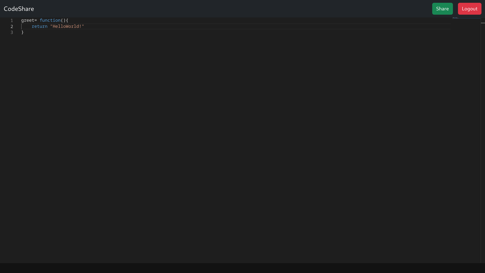

# Online Text Editor

A web-based text editor application built with Flask that allows users to create, edit, and save code snippets with real-time autosave functionality.

## Live Demo
Visit the project: [https://codeshareapp.onrender.com](https://codeshareapp.onrender.com)

## Features

- User Authentication System
  - Register new accounts
  - Login/Logout functionality
  - Secure password hashing using bcrypt
- Code Editor
  - Create new files with unique IDs
  - Auto-save functionality
  - View list of saved code snippets
- Secure Session Management
- SQLite Database Integration
